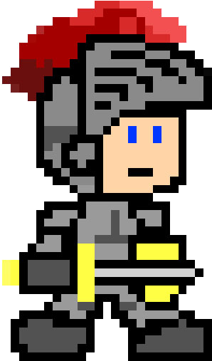

<!-- PROJECT LOGO -->
 

    

  <h3 class ="text-center" >Knight-Clicker</h3>

  

     Exercise en équipe à Becode pour mieux comprendre du Javascript, Tailwind et la logique d'un Cookie-Clicker      
  

  <a text-align="center" href=https://eradikalien.github.io/knight-clicker/>LIVE-PAGE</a>

#### Construit avec

* 
* 
* 

<!-- ROADMAP -->
#### DevTeam

* <a href="https://github.com/IronNetta">Sébastien</a>
* <a href="https://github.com/EradikAlien">Laurent</a>
* <a href="https://github.com/KimJacobus">Kim</a>

#### DevTeam

* <a href="https://github.com/IronNetta">Sébastien</a>
* <a href="https://github.com/EradikAlien">Laurent</a>
* <a href="https://github.com/KimJacobus">Kim</a>

#### Develop

* git clone project
* yarn install # or npm run install to install dependencies
* yarn run start # or npm run start to start developing

<!-- ACKNOWLEDGMENTS -->
#### Acknowledgments

* [Img Shields](https://shields.io)
* [GitHub Pages](https://pages.github.com)

